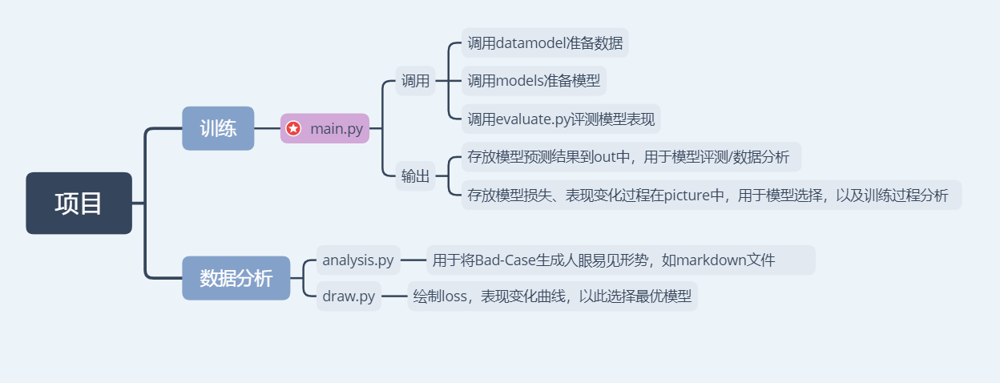
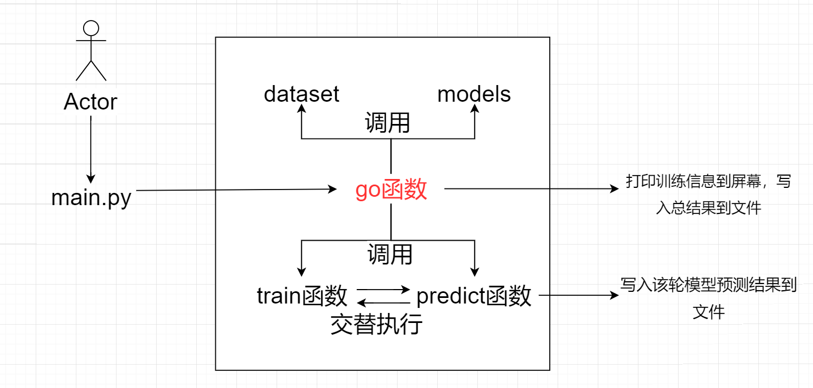

# 1 项目简介
该项目提供一个自己总结的Pytorch实现深度学习的模板。方便自己快速搭建深度学习模型

# 2 项目目录

```
|—— checkpoints     # 存放训练模型参数
|—— models          # 存放自己定义的网络模型
|—— out             # 存放模型的预测结果，如NER: 所有词极其BIO形式
|—— dataset         # 存放原始数据以及自己定义的DataModel，用来加载数据
|—— |—— DataModel.py
|—— config.py       # 用于管理模型超参数
|—— utils.py        # 包含一些工具函数文件，如时间函数，制图函数，平均损失计算函数等
|—— mian.py         # 主函数
|—— evaluate.py     # 对应任务的模型表现评测文件
|—— analysis.py     # 对应任务的模型Bad-Case报告文件
|—— picture         # 用来存储用于制图的模型训练过程【损失】、【表现】随epoch变化的文件，以及draw.py函数绘制的图片
|—— draw.py         # 根据模型训练过程的【损失】、【表现】随epoch变化的文件绘制图像，并选出最优模型
|—— README.md
```

# 3 项目总览


# 4 训练模块
训练模块由`main.py`完成，改文件也是整个项目的总入口，我将其定义为训练模块，但其实其包括【前期准备】、【模型训练】、【模型预测评估】三个过程，本着此原则，我设计了`main.py`文件的总接口`go`函数(go意为出发，即开始运行项目)，其用于与用户直接交互(接收命令行的参数)，以完成前期准备工作，然后循环调用`train`以及`predict`两个函数，以实现训练模块的功能

- 图示如下：


## 4.1 前期准备模块
前期准备模块功能有【参数设置】、【数据处理】、【模型搭建】, 其在`config.py`,`dataset`与`models`三个文件下完成.
- 参数设置：`config.py`中实例化的`opt`用来管理参数，通过命令行`parse`更新默认参数值，并打印相关信息到控制台。
- 数据处理：
`dataset`中的`dataset.py`文件中有用来管理数据的`DataModel`类，其继承了`pytorch`本身的`Dataset`类，用来实现处理数据和管理数据的功能，其成员有
    - `DataProcessor`类(用来进行数据预处理成`npy`形式，如果数据集较大，我们便存储`npy`文件)，以及需要提供的数据
    - `self.data`：需要提供给`go`函数的数据(`npy`形式的列表,并且需要对列表进行`zip`操作)
- 模型搭建: `models`中用来存放自己编写的`pytorch`神经网络模型，其中`BasicModel.py`定义了每个模型都有的`模型存储`和`模型加载`功能，是所有待编写模型的父类.

注意: `dataset`和`models`两个文件夹下都需要有一个`__init__.py`文件，在其中引入对应的类，才能使得文件夹本身成为一个包，供`main.py`调用

# 5 数据分析
该模块包括有针对特定任务的`analysis.py`文件，也有固定的`draw.py`文件，详细见代码。


